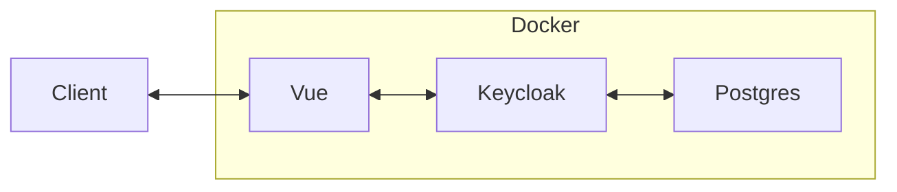

# Docker + Postgres + Keycloak + Vue

```mermaid
graph LR
    client <--> vue
    client[Client]

    subgraph Docker
        direction TB

        postgres[Postgres]
        keycloak[Keycloak]
        vue[Vue]

        vue <--> keycloak
        keycloak <--> postgres
    end
```
